# Technical references report

Generated: 2026-05-29T12:29:12.469053+00:00

Open **`index.html`** in this folder for the interactive version.

## Summary

| Metric | Count |
|--------|------:|
| Total references | 81 |
| Downloaded / unchanged | 54 |
| Unavailable | 27 |
| Other | 0 |
| Legal → specification links | 116 |
| Specification → specification links | 24 |

### By standardization body

| Body | Total | Downloaded |
|------|------:|-----------:|
| ARF | 13 | 13 |
| CEN | 2 | 0 |
| ETSI | 33 | 31 |
| IETF | 9 | 9 |
| ISO-IEC | 23 | 0 |
| W3C | 1 | 1 |

## Downloaded references

| Specification | Version | Summary | Scope keywords | Folder | Download |
|---------------|---------|---------|----------------|--------|----------|
| EC technical specifications (TS01–TS11) | — | European Commission complementary technical specifications (TS01–TS11) published with the EUDI Wallet Architecture and R | attestation, eudi, pid, trust, wallet | `ARF` | [link](https://github.com/eu-digital-identity-wallet/eudi-doc-architecture-and-reference-framework/tree/main/docs/technical-specifications) |
| TS01 | 1.1.2 | The present document specifies the technical specification and requirements for EUDI Wallet Trust Mark. | eudi, trust, wallet | `ARF/TS01-V1.1.2` | [link](https://raw.githubusercontent.com/eu-digital-identity-wallet/eudi-doc-standards-and-technical-specifications/main/docs/technical-specifications/ts1-eudi-wallet-trust-mark.md) |
| TS02 | 1.0.1 | The present document specifies the data model and systems enabling the notification and subsequent publication of Provid | — | `ARF/TS02-V1.0.1` | [link](https://raw.githubusercontent.com/eu-digital-identity-wallet/eudi-doc-standards-and-technical-specifications/main/docs/technical-specifications/ts2-notification-publication-provider-information.md) |
| TS03 | 1.5.1 | The present document specifies how Wallet Unit Attestations (WUAs) -- comprising Wallet Instance Attestations (WIAs) and | attestation, attestations, eudi, key, pid | `ARF/TS03-V1.5.1` | [link](https://raw.githubusercontent.com/eu-digital-identity-wallet/eudi-doc-standards-and-technical-specifications/main/docs/technical-specifications/ts3-wallet-unit-attestation.md) |
| TS04 | 1.0.1 | The present document specifies the technical specification and requirements for Zero-Knowledge Proof (ZKP) Implementatio | eudi, wallet | `ARF/TS04-V1.0.1` | [link](https://raw.githubusercontent.com/eu-digital-identity-wallet/eudi-doc-standards-and-technical-specifications/main/docs/technical-specifications/ts4-zkp.md) |
| TS05 | 1.2.1 | The present document specifies the data formats and application programming interface (API) for the machine-readable Rel | — | `ARF/TS05-V1.2.1` | [link](https://raw.githubusercontent.com/eu-digital-identity-wallet/eudi-doc-standards-and-technical-specifications/main/docs/technical-specifications/ts5-common-formats-and-api-for-rp-registration-information.md) |
| TS06 | 1.0.1 | The present document specifies the common data set required for Relying Party Registration as required by the European D | — | `ARF/TS06-V1.0.1` | [link](https://raw.githubusercontent.com/eu-digital-identity-wallet/eudi-doc-standards-and-technical-specifications/main/docs/technical-specifications/ts6-common-set-of-rp-information-to-be-registered.md) |
| TS07 | 0.11 | The present document specifies the common protocols and interfaces according to Article 5a (5) (a) (ix) of
(EU) No 910/2 | wallet | `ARF/TS07-V0.11` | [link](https://raw.githubusercontent.com/eu-digital-identity-wallet/eudi-doc-standards-and-technical-specifications/main/docs/technical-specifications/ts7-common-interface-for-data-deletion-request.md) |
| TS08 | 0.11 | The present document specifies the common protocols and interfaces according to Article 5a (5) (a) (x) of
(EU) No 910/20 | wallet | `ARF/TS08-V0.11` | [link](https://raw.githubusercontent.com/eu-digital-identity-wallet/eudi-doc-standards-and-technical-specifications/main/docs/technical-specifications/ts8-common-interface-for-reporting-of-wrp-to-dpa.md) |
| TS09 | 1.0.1 | The present document specifies the common protocols and interfaces according to Article 5a (4) (c) and Article 5a (5) (a | wallet | `ARF/TS09-V1.0.1` | [link](https://raw.githubusercontent.com/eu-digital-identity-wallet/eudi-doc-standards-and-technical-specifications/main/docs/technical-specifications/ts9-wallet-to-wallet-interactions.md) |
| TS10 | 1.2 | The present document specifies the common format and data set for the transaction log and the Migration Object, as well  | wallet | `ARF/TS10-V1.2` | [link](https://raw.githubusercontent.com/eu-digital-identity-wallet/eudi-doc-standards-and-technical-specifications/main/docs/technical-specifications/ts10-data-portability-and-download-%28export%29.md) |
| TS11 | 1.0.1 | The present document specifies the interfaces and formats of European Commission’s catalogue of attributes and catalogue | attestation, attestations, attribute, attributes, delivery | `ARF/TS11-V1.0.1` | [link](https://raw.githubusercontent.com/eu-digital-identity-wallet/eudi-doc-standards-and-technical-specifications/main/docs/technical-specifications/ts11-interfaces-and-formats-for-catalogue-of-attributes-and-catalogue-of-schemes.md) |
| TS12 | 1.0.1 | The present document specifies data structures and processing rules for conducting Strong Customer Authentication (SCA)  | authentication, wallet, wallets | `ARF/TS12-V1.0.1` | [link](https://raw.githubusercontent.com/eu-digital-identity-wallet/eudi-doc-standards-and-technical-specifications/main/docs/technical-specifications/ts12-electronic-payments-SCA-implementation-with-wallet.md) |
| EN 319 102-1 | 1.4.1 | Covers: electronic signature, security, trust services. | electronic signature, security, trust services, 319, 102-1 | `ETSI/EN-319-102-1-V1.4.1` | [link](https://www.etsi.org/deliver/etsi_en/319100_319199/31910201/01.04.01_60/en_31910201v010401p.pdf) |
| EN 319 122-1 | 1.3.1 | Covers: ASN.1, CAdES, electronic signature, profile, security. | asn.1, cades, electronic signature, profile, security | `ETSI/EN-319-122-1-V1.3.1` | [link](https://www.etsi.org/deliver/etsi_en/319100_319199/31912201/01.03.01_60/en_31912201v010301p.pdf) |
| EN 319 132-1 | 1.3.1 | Covers: electronic signature, security, XAdES, XML. | electronic signature, security, xades, xml, 319 | `ETSI/EN-319-132-1-V1.3.1` | [link](https://www.etsi.org/deliver/etsi_en/319100_319199/31913201/01.03.01_60/en_31913201v010301p.pdf) |
| EN 319 142-1 | 1.1.1 | Covers: electronic signature, PAdES, profile, security. | electronic signature, pades, profile, security, 319 | `ETSI/EN-319-142-1-V1.1.1` | [link](https://www.etsi.org/deliver/etsi_en/319100_319199/31914201/01.01.01_60/en_31914201v010101p.pdf) |
| EN 319 162-1 | 1.1.1 | Covers: ASiC, e-commerce, electronic signature, security. | asic, e-commerce, electronic signature, security, 319 | `ETSI/EN-319-162-1-V1.1.1` | [link](https://www.etsi.org/deliver/etsi_en/319100_319199/31916201/01.01.01_60/en_31916201v010101p.pdf) |
| EN 319 162-2 | 1.1.1 | Covers: ASiC, e-commerce, electronic signature, security. | asic, e-commerce, electronic signature, security, 319 | `ETSI/EN-319-162-2-V1.1.1` | [link](https://www.etsi.org/deliver/etsi_en/319100_319199/31916202/01.01.01_60/en_31916202v010101p.pdf) |
| EN 319 401 | 3.1.1 | Covers: electronic signature, provider, security, trust services. | electronic signature, provider, security, trust services, 319 | `ETSI/EN-319-401-V3.1.1` | [link](https://www.etsi.org/deliver/etsi_en/319400_319499/319401/03.01.01_60/en_319401v030101p.pdf) |
| EN 319 403-1 | 2.3.1 | Covers: conformity, e-commerce, electronic signature, security, trust services. | conformity, e-commerce, electronic signature, security, trust services | `ETSI/EN-319-403-1-V2.3.1` | [link](https://www.etsi.org/deliver/etsi_en/319400_319499/31940301/02.03.01_60/en_31940301v020301p.pdf) |
| EN 319 411-1 | 1.5.1 | Covers: e-commerce, electronic signature, extended validation certificate, public key, security, trust services. | e-commerce, electronic signature, extended validation certificate, public key, security | `ETSI/EN-319-411-1-V1.5.1` | [link](https://www.etsi.org/deliver/etsi_en/319400_319499/31941101/01.05.01_60/en_31941101v010501p.pdf) |
| EN 319 411-2 | 2.6.1 | Covers: e-commerce, electronic signature, security, trust services. | e-commerce, electronic signature, security, trust services, 319 | `ETSI/EN-319-411-2-V2.6.1` | [link](https://www.etsi.org/deliver/etsi_en/319400_319499/31941102/02.06.01_60/en_31941102v020601p.pdf) |
| EN 319 412-1 | 1.6.1 | Covers: e-commerce, electronic signature, security, trust services. | e-commerce, electronic signature, security, trust services, 319 | `ETSI/EN-319-412-1-V1.6.1` | [link](https://www.etsi.org/deliver/etsi_en/319400_319499/31941201/01.06.01_60/en_31941201v010601p.pdf) |
| EN 319 412-2 | 2.4.1 | Covers: electronic signature, profile, security, trust services. | electronic signature, profile, security, trust services, 319 | `ETSI/EN-319-412-2-V2.4.1` | [link](https://www.etsi.org/deliver/etsi_en/319400_319499/31941202/02.04.01_60/en_31941202v020401p.pdf) |
| EN 319 412-3 | 1.3.1 | Covers: electronic signature, profile, security, trust services. | electronic signature, profile, security, trust services, 319 | `ETSI/EN-319-412-3-V1.3.1` | [link](https://www.etsi.org/deliver/etsi_en/319400_319499/31941203/01.03.01_60/en_31941203v010301p.pdf) |
| EN 319 412-5 | 2.5.1 | Covers: e-commerce, electronic signature, security, trust services. | e-commerce, electronic signature, security, trust services, 319 | `ETSI/EN-319-412-5-V2.5.1` | [link](https://www.etsi.org/deliver/etsi_en/319400_319499/31941205/02.05.01_60/en_31941205v020501p.pdf) |
| EN 319 421 | 1.3.1 | Covers: e-commerce, electronic signature, security, timestamping, trust services. | e-commerce, electronic signature, security, timestamping, trust services | `ETSI/EN-319-421-V1.3.1` | [link](https://www.etsi.org/deliver/etsi_en/319400_319499/319421/01.03.01_60/en_319421v010301p.pdf) |
| EN 319 422 | 1.1.1 | Covers: electronic signature, security, time-stamping, trust services. | electronic signature, security, time-stamping, trust services, 319 | `ETSI/EN-319-422-V1.1.1` | [link](https://www.etsi.org/deliver/etsi_en/319400_319499/319422/01.01.01_60/en_319422v010101p.pdf) |
| EN 319 521 | 1.1.1 | Covers: e-delivery services, policy requirements, registered e-delivery services, security, trust services. | e-delivery services, policy requirements, registered e-delivery services, security, trust services | `ETSI/EN-319-521-V1.1.1` | [link](https://www.etsi.org/deliver/etsi_en/319500_319599/319521/01.01.01_60/en_319521v010101p.pdf) |
| EN 319 522-1 | 1.2.1 | Covers: e-delivery services, registered e-delivery services, registered electronic mail. | e-delivery services, registered e-delivery services, registered electronic mail, 319, 522-1 | `ETSI/EN-319-522-1-V1.2.1` | [link](https://www.etsi.org/deliver/etsi_en/319500_319599/31952201/01.02.01_60/en_31952201v010201p.pdf) |
| EN 319 522-2 | 1.2.1 | Covers: e-delivery services, registered e-delivery services, registered electronic mail. | e-delivery services, registered e-delivery services, registered electronic mail, 319, 522-2 | `ETSI/EN-319-522-2-V1.2.1` | [link](https://www.etsi.org/deliver/etsi_en/319500_319599/31952202/01.02.01_60/en_31952202v010201p.pdf) |
| EN 319 522-3 | 1.2.1 | Covers: e-delivery services, registered e-delivery services, registered electronic mail. | e-delivery services, registered e-delivery services, registered electronic mail, 319, 522-3 | `ETSI/EN-319-522-3-V1.2.1` | [link](https://www.etsi.org/deliver/etsi_en/319500_319599/31952203/01.02.01_60/en_31952203v010201p.pdf) |
| TS 119 101 | 1.1.1 | Covers: e-commerce, electronic signature, security, trust services. | e-commerce, electronic signature, security, trust services, 119 | `ETSI/TS-119-101-V1.1.1` | [link](https://www.etsi.org/deliver/etsi_ts/119100_119199/119101/01.01.01_60/ts_119101v010101p.pdf) |
| TS 119 102-2 | 1.4.1 | Covers: electronic signature, trust services, validation. | electronic signature, trust services, validation, 119, 102-2 | `ETSI/TS-119-102-2-V1.4.1` | [link](https://www.etsi.org/deliver/etsi_ts/119100_119199/11910202/01.04.01_60/ts_11910202v010401p.pdf) |
| TS 119 172-4 | 1.1.1 | Covers: e-commerce, electronic signature, trust services. | e-commerce, electronic signature, trust services, 119, 172-4 | `ETSI/TS-119-172-4-V1.1.1` | [link](https://www.etsi.org/deliver/etsi_ts/119100_119199/11917204/01.01.01_60/ts_11917204v010101p.pdf) |
| TS 119 182-1 | 1.2.1 | Covers: electronic signature, JSON. | electronic signature, json, 119, 182-1, authorization | `ETSI/TS-119-182-1-V1.2.1` | [link](https://www.etsi.org/deliver/etsi_ts/119100_119199/11918201/01.02.01_60/ts_11918201v010201p.pdf) |
| TS 119 411-5 | 2.1.1 | Covers: cyber security, electronic signature, extended validation certificate, internet, public key, security, trust ser | cyber security, electronic signature, extended validation certificate, internet, public key | `ETSI/TS-119-411-5-V2.1.1` | [link](https://www.etsi.org/deliver/etsi_ts/119400_119499/11941105/02.01.01_60/ts_11941105v020101p.pdf) |
| TS 119 431-1 | 1.3.1 | Covers: e-commerce, electronic signature, remote, security, trust services. | e-commerce, electronic signature, remote, security, trust services | `ETSI/TS-119-431-1-V1.3.1` | [link](https://www.etsi.org/deliver/etsi_ts/119400_119499/11943101/01.03.01_60/ts_11943101v010301p.pdf) |
| TS 119 441 | 1.2.1 | Covers: electronic signature, security, trust services. | electronic signature, security, trust services, 119, 441 | `ETSI/TS-119-441-V1.2.1` | [link](https://www.etsi.org/deliver/etsi_ts/119400_119499/119441/01.02.01_60/ts_119441v010201p.pdf) |
| TS 119 461 | 2.1.1 | Covers: electronic signature, security, trust services. | electronic signature, security, trust services, 119, 461 | `ETSI/TS-119-461-V2.1.1` | [link](https://www.etsi.org/deliver/etsi_ts/119400_119499/119461/02.01.01_60/ts_119461v020101p.pdf) |
| TS 119 495 | 1.7.1 | Covers: e-commerce, electronic signature, extended validation certificate, payment, public key, security, trust services | e-commerce, electronic signature, extended validation certificate, payment, public key | `ETSI/TS-119-495-V1.7.1` | [link](https://www.etsi.org/deliver/etsi_ts/119400_119499/119495/01.07.01_60/ts_119495v010701p.pdf) |
| TS 119 511 | 1.1.1 | Covers: electronic preservation, electronic signature, trust services. | electronic preservation, electronic signature, trust services, 119, 511 | `ETSI/TS-119-511-V1.1.1` | [link](https://www.etsi.org/deliver/etsi_ts/119500_119599/119511/01.01.01_60/ts_119511v010101p.pdf) |
| TS 119 612 | 2.4.1 | Covers: e-commerce, electronic signature, security, trust services. | e-commerce, electronic signature, security, trust services, 119 | `ETSI/TS-119-612-V2.4.1` | [link](https://www.etsi.org/deliver/etsi_ts/119600_119699/119612/02.04.01_60/ts_119612v020401p.pdf) |
| RFC 3161 | — | This document describes the format of a request sent to a Time
 Stamping Authority (TSA) and of the response that is ret | 3161, algorithm, certificate, hash, identification | `IETF/RFC-3161` | [link](https://www.rfc-editor.org/rfc/rfc3161.txt) |
| RFC 3647 | — | This document presents a framework to assist the writers of
 certificate policies or certification practice statements f | 3647, audit, authentication, certificate, certificates | `IETF/RFC-3647` | [link](https://www.rfc-editor.org/rfc/rfc3647.txt) |
| RFC 3739 | — | This document forms a certificate profile, based on RFC 3280, for
 identity certificates issued to natural persons.

 Th | 3739, attribute, attributes, certificate, certificates | `IETF/RFC-3739` | [link](https://www.rfc-editor.org/rfc/rfc3739.txt) |
| RFC 5280 | — | This memo profiles the X.509 v3 certificate and X.509 v2 certificate
 revocation list (CRL) for use in the Internet. An  | 5280, accreditation, algorithm, attribute, attributes | `IETF/RFC-5280` | [link](https://www.rfc-editor.org/rfc/rfc5280.txt) |
| RFC 5322 | — | This document specifies the Internet Message Format (IMF), a syntax
 for text messages that are sent between computer us | 5322, attestation, attestations, attribute, attributes | `IETF/RFC-5322` | [link](https://www.rfc-editor.org/rfc/rfc5322.txt) |
| RFC 7515 | — | JSON Web Signature (JWS) represents content secured with digital
 signatures or Message Authentication Codes (MACs) usin | 7515, algorithm, algorithms, authentication, certificate | `IETF/RFC-7515` | [link](https://www.rfc-editor.org/rfc/rfc7515.txt) |
| RFC 7519 | — | JSON Web Token (JWT) is a compact, URL-safe means of representing
 claims to be transferred between two parties. The cla | 7519, authentication, authorization, encryption, http | `IETF/RFC-7519` | [link](https://www.rfc-editor.org/rfc/rfc7519.txt) |
| RFC 8392 | — | CBOR Web Token (CWT) is a compact means of representing claims to be
 transferred between two parties. The claims in a C | 8392, algorithm, encryption, http, https | `IETF/RFC-8392` | [link](https://www.rfc-editor.org/rfc/rfc8392.txt) |
| RFC 9110 | — | The Hypertext Transfer Protocol (HTTP) is a stateless application-
 level protocol for distributed, collaborative, hyper | 9110, authentication, authorization, certificate, credential | `IETF/RFC-9110` | [link](https://www.rfc-editor.org/rfc/rfc9110.txt) |
| vc-data-model | 1.1 | Abstract 
 
A verifiable credential is a specific way to express a set of claims 
made by an issuer , such as a driver's | model, algorithm, attestation, attestations, attribute | `W3C/vc-data-model-V1.1` | [link](https://www.w3.org/TR/vc-data-model/) |

## Unavailable references

| Specification | Version | Tags | Download URL |
|---------------|---------|------|--------------|
| CEN CEN/TS 18170 V2025 | 2025 | cited-by-eu-law, common-criteria, implementing-regulation, unavailable | [link](https://standards.cencenelec.eu/dyn/www/f?p=204:32:0::::FSP_PROJECT,FSP_LANG_ID:18170,25) |
| CEN CEN/TS 419261 V2015 | 2015 | cited-by-eu-law, implementing-regulation, trust-services, unavailable | [link](https://standards.cencenelec.eu/dyn/www/f?p=204:32:0::::FSP_PROJECT,FSP_LANG_ID:419261,25) |
| ETSI EN 3191 22-1 V1.3.1 | 1.3.1 | 319-series, cited-by-eu-law, implementing-regulation, trust-services, unavailabl | [link](https://www.etsi.org/deliver/etsi_en/3191000_3191099/319102201/01.03.01_60/en_319102201v010301p.pdf) |
| ETSI EN 319403-1 V2.3.1 | 2.3.1 | 319-series, cited-by-eu-law, implementing-regulation, trust-services, unavailabl | [link](https://www.etsi.org/deliver/etsi_en/3194000_3194099/319403001/02.03.01_60/en_319403001v020301p.pdf) |
| ISO-IEC ISO 14641 | — | cited-by-eu-law, implementing-regulation, unavailable | [link](https://www.iso.org/search.html?q=ISO+14641) |
| ISO-IEC ISO 14721 V2025 | 2025 | cited-by-eu-law, implementing-regulation, unavailable | [link](https://www.iso.org/search.html?q=ISO+14721) |
| ISO-IEC ISO 19794-5 | — | cited-by-eu-law, implementing-regulation, unavailable | [link](https://www.iso.org/search.html?q=ISO+19794-5) |
| ISO-IEC ISO 23257 V2022 | 2022 | cited-by-eu-law, implementing-regulation, unavailable | [link](https://www.iso.org/search.html?q=ISO+23257) |
| ISO-IEC ISO 3166 | — | cited-by-eu-law, implementing-regulation, unavailable | [link](https://www.iso.org/search.html?q=ISO+3166) |
| ISO-IEC ISO 3166-1 V2006 | 2006 | cited-by-eu-law, implementing-decision, implementing-regulation, unavailable | [link](https://www.iso.org/search.html?q=ISO+3166-1) |
| ISO-IEC ISO 3166-2 V2020 | 2020 | cited-by-eu-law, implementing-regulation, unavailable | [link](https://www.iso.org/search.html?q=ISO+3166-2) |
| ISO-IEC ISO 39794 | — | cited-by-eu-law, implementing-regulation, unavailable | [link](https://www.iso.org/search.html?q=ISO+39794) |
| ISO-IEC ISO/IEC 15408 V2022 | 2022 | cited-by-eu-law, common-criteria, implementing-regulation, unavailable | [link](https://www.iso.org/search.html?q=ISO%2FIEC+15408) |
| ISO-IEC ISO/IEC 15408-1 V2022 | 2022 | cited-by-eu-law, common-criteria, implementing-regulation, unavailable | [link](https://www.iso.org/search.html?q=ISO%2FIEC+15408-1) |
| ISO-IEC ISO/IEC 15408-3 V2022 | 2022 | cited-by-eu-law, common-criteria, implementing-regulation, unavailable | [link](https://www.iso.org/search.html?q=ISO%2FIEC+15408-3) |
| ISO-IEC ISO/IEC 17000 V2020 | 2020 | cited-by-eu-law, implementing-regulation, unavailable | [link](https://www.iso.org/search.html?q=ISO%2FIEC+17000) |
| ISO-IEC ISO/IEC 17011 V2017 | 2017 | cited-by-eu-law, implementing-regulation, unavailable | [link](https://www.iso.org/search.html?q=ISO%2FIEC+17011) |
| ISO-IEC ISO/IEC 17020 V2012 | 2012 | cited-by-eu-law, implementing-regulation, unavailable | [link](https://www.iso.org/search.html?q=ISO%2FIEC+17020) |
| ISO-IEC ISO/IEC 17021-1 V2015 | 2015 | cited-by-eu-law, implementing-regulation, unavailable | [link](https://www.iso.org/search.html?q=ISO%2FIEC+17021-1) |
| ISO-IEC ISO/IEC 17025 V2017 | 2017 | cited-by-eu-law, implementing-regulation, unavailable | [link](https://www.iso.org/search.html?q=ISO%2FIEC+17025) |
| ISO-IEC ISO/IEC 17029 V2019 | 2019 | cited-by-eu-law, implementing-regulation, unavailable | [link](https://www.iso.org/search.html?q=ISO%2FIEC+17029) |
| ISO-IEC ISO/IEC 17065 V2012 | 2012 | cited-by-eu-law, implementing-regulation, unavailable | [link](https://www.iso.org/search.html?q=ISO%2FIEC+17065) |
| ISO-IEC ISO/IEC 17067 V2013 | 2013 | cited-by-eu-law, implementing-regulation, unavailable | [link](https://www.iso.org/search.html?q=ISO%2FIEC+17067) |
| ISO-IEC ISO/IEC 18013-5 V2021 | 2021 | cited-by-eu-law, implementing-regulation, unavailable | [link](https://www.iso.org/search.html?q=ISO%2FIEC+18013-5) |
| ISO-IEC ISO/IEC 27001 V2022 | 2022 | cited-by-eu-law, implementing-regulation, unavailable | [link](https://www.iso.org/search.html?q=ISO%2FIEC+27001) |
| ISO-IEC ISO/IEC 30111 V2019 | 2019 | cited-by-eu-law, implementing-regulation, unavailable | [link](https://www.iso.org/search.html?q=ISO%2FIEC+30111) |
| ISO-IEC ISO/IEC 5218 | — | cited-by-eu-law, implementing-regulation, unavailable | [link](https://www.iso.org/search.html?q=ISO%2FIEC+5218) |

## Links from EU legal acts

| Legal act | CELEX | Specification cited | Source in corpus |
|-----------|-------|---------------------|------------------|
| 2024-2977 | 32024R2977 | IETF RFC 5322 | `implementing-acts/2024-2977/2024-2977.md` — [md](../implementing-acts/2024-2977/2024-2977.md), [html](../implementing-acts/2024-2977/2024-2977.html), [pdf](../implementing-acts/2024-2977/2024-2977.pdf) |
| 2024-2977 | 32024R2977 | ISO-IEC ISO 19794-5 | `implementing-acts/2024-2977/2024-2977.md` — [md](../implementing-acts/2024-2977/2024-2977.md), [html](../implementing-acts/2024-2977/2024-2977.html), [pdf](../implementing-acts/2024-2977/2024-2977.pdf) |
| 2024-2977 | 32024R2977 | ISO-IEC ISO 3166 | `implementing-acts/2024-2977/2024-2977.md` — [md](../implementing-acts/2024-2977/2024-2977.md), [html](../implementing-acts/2024-2977/2024-2977.html), [pdf](../implementing-acts/2024-2977/2024-2977.pdf) |
| 2024-2977 | 32024R2977 | ISO-IEC ISO 3166-1 V2006 | `implementing-acts/2024-2977/2024-2977.md` — [md](../implementing-acts/2024-2977/2024-2977.md), [html](../implementing-acts/2024-2977/2024-2977.html), [pdf](../implementing-acts/2024-2977/2024-2977.pdf) |
| 2024-2977 | 32024R2977 | ISO-IEC ISO 3166-2 V2020 | `implementing-acts/2024-2977/2024-2977.md` — [md](../implementing-acts/2024-2977/2024-2977.md), [html](../implementing-acts/2024-2977/2024-2977.html), [pdf](../implementing-acts/2024-2977/2024-2977.pdf) |
| 2024-2977 | 32024R2977 | ISO-IEC ISO 39794 | `implementing-acts/2024-2977/2024-2977.md` — [md](../implementing-acts/2024-2977/2024-2977.md), [html](../implementing-acts/2024-2977/2024-2977.html), [pdf](../implementing-acts/2024-2977/2024-2977.pdf) |
| 2024-2977 | 32024R2977 | ISO-IEC ISO/IEC 18013-5 V2021 | `implementing-acts/2024-2977/2024-2977.md` — [md](../implementing-acts/2024-2977/2024-2977.md), [html](../implementing-acts/2024-2977/2024-2977.html), [pdf](../implementing-acts/2024-2977/2024-2977.pdf) |
| 2024-2977 | 32024R2977 | ISO-IEC ISO/IEC 5218 | `implementing-acts/2024-2977/2024-2977.md` — [md](../implementing-acts/2024-2977/2024-2977.md), [html](../implementing-acts/2024-2977/2024-2977.html), [pdf](../implementing-acts/2024-2977/2024-2977.pdf) |
| 2024-2977 | 32024R2977 | W3C vc-data-model V1.1 | `implementing-acts/2024-2977/2024-2977.md` — [md](../implementing-acts/2024-2977/2024-2977.md), [html](../implementing-acts/2024-2977/2024-2977.html), [pdf](../implementing-acts/2024-2977/2024-2977.pdf) |
| 2024-2979 | 32024R2979 | ETSI EN 319 132-1 V1.3.1 | `implementing-acts/2024-2979/2024-2979.md` — [md](../implementing-acts/2024-2979/2024-2979.md), [html](../implementing-acts/2024-2979/2024-2979.html), [pdf](../implementing-acts/2024-2979/2024-2979.pdf) |
| 2024-2979 | 32024R2979 | ETSI EN 319 142-1 V1.1.1 | `implementing-acts/2024-2979/2024-2979.md` — [md](../implementing-acts/2024-2979/2024-2979.md), [html](../implementing-acts/2024-2979/2024-2979.html), [pdf](../implementing-acts/2024-2979/2024-2979.pdf) |
| 2024-2979 | 32024R2979 | ETSI EN 319 162-1 V1.1.1 | `implementing-acts/2024-2979/2024-2979.md` — [md](../implementing-acts/2024-2979/2024-2979.md), [html](../implementing-acts/2024-2979/2024-2979.html), [pdf](../implementing-acts/2024-2979/2024-2979.pdf) |
| 2024-2979 | 32024R2979 | ETSI EN 319 162-2 V1.1.1 | `implementing-acts/2024-2979/2024-2979.md` — [md](../implementing-acts/2024-2979/2024-2979.md), [html](../implementing-acts/2024-2979/2024-2979.html), [pdf](../implementing-acts/2024-2979/2024-2979.pdf) |
| 2024-2979 | 32024R2979 | ETSI EN 3191 22-1 V1.3.1 | `implementing-acts/2024-2979/2024-2979.md` — [md](../implementing-acts/2024-2979/2024-2979.md), [html](../implementing-acts/2024-2979/2024-2979.html), [pdf](../implementing-acts/2024-2979/2024-2979.pdf) |
| 2024-2979 | 32024R2979 | ETSI TS 119 182-1 V1.2.1 | `implementing-acts/2024-2979/2024-2979.md` — [md](../implementing-acts/2024-2979/2024-2979.md), [html](../implementing-acts/2024-2979/2024-2979.html), [pdf](../implementing-acts/2024-2979/2024-2979.pdf) |
| 2024-2979 | 32024R2979 | W3C vc-data-model V1.1 | `implementing-acts/2024-2979/2024-2979.md` — [md](../implementing-acts/2024-2979/2024-2979.md), [html](../implementing-acts/2024-2979/2024-2979.html), [pdf](../implementing-acts/2024-2979/2024-2979.pdf) |
| 2024-2980 | 32024R2980 | IETF RFC 3647 | `implementing-acts/2024-2980/2024-2980.md` — [md](../implementing-acts/2024-2980/2024-2980.md), [html](../implementing-acts/2024-2980/2024-2980.html), [pdf](../implementing-acts/2024-2980/2024-2980.pdf) |
| 2024-2981 | 32024R2981 | ISO-IEC ISO/IEC 15408-3 V2022 | `implementing-acts/2024-2981/2024-2981.md` — [md](../implementing-acts/2024-2981/2024-2981.md), [html](../implementing-acts/2024-2981/2024-2981.html), [pdf](../implementing-acts/2024-2981/2024-2981.pdf) |
| 2024-2981 | 32024R2981 | ISO-IEC ISO/IEC 17000 V2020 | `implementing-acts/2024-2981/2024-2981.md` — [md](../implementing-acts/2024-2981/2024-2981.md), [html](../implementing-acts/2024-2981/2024-2981.html), [pdf](../implementing-acts/2024-2981/2024-2981.pdf) |
| 2024-2981 | 32024R2981 | ISO-IEC ISO/IEC 17020 V2012 | `implementing-acts/2024-2981/2024-2981.md` — [md](../implementing-acts/2024-2981/2024-2981.md), [html](../implementing-acts/2024-2981/2024-2981.html), [pdf](../implementing-acts/2024-2981/2024-2981.pdf) |
| 2024-2981 | 32024R2981 | ISO-IEC ISO/IEC 17021-1 V2015 | `implementing-acts/2024-2981/2024-2981.md` — [md](../implementing-acts/2024-2981/2024-2981.md), [html](../implementing-acts/2024-2981/2024-2981.html), [pdf](../implementing-acts/2024-2981/2024-2981.pdf) |
| 2024-2981 | 32024R2981 | ISO-IEC ISO/IEC 17025 V2017 | `implementing-acts/2024-2981/2024-2981.md` — [md](../implementing-acts/2024-2981/2024-2981.md), [html](../implementing-acts/2024-2981/2024-2981.html), [pdf](../implementing-acts/2024-2981/2024-2981.pdf) |
| 2024-2981 | 32024R2981 | ISO-IEC ISO/IEC 17029 V2019 | `implementing-acts/2024-2981/2024-2981.md` — [md](../implementing-acts/2024-2981/2024-2981.md), [html](../implementing-acts/2024-2981/2024-2981.html), [pdf](../implementing-acts/2024-2981/2024-2981.pdf) |
| 2024-2981 | 32024R2981 | ISO-IEC ISO/IEC 17065 V2012 | `implementing-acts/2024-2981/2024-2981.md` — [md](../implementing-acts/2024-2981/2024-2981.md), [html](../implementing-acts/2024-2981/2024-2981.html), [pdf](../implementing-acts/2024-2981/2024-2981.pdf) |
| 2024-2981 | 32024R2981 | ISO-IEC ISO/IEC 17067 V2013 | `implementing-acts/2024-2981/2024-2981.md` — [md](../implementing-acts/2024-2981/2024-2981.md), [html](../implementing-acts/2024-2981/2024-2981.html), [pdf](../implementing-acts/2024-2981/2024-2981.pdf) |
| 2024-2981 | 32024R2981 | ISO-IEC ISO/IEC 27001 V2022 | `implementing-acts/2024-2981/2024-2981.md` — [md](../implementing-acts/2024-2981/2024-2981.md), [html](../implementing-acts/2024-2981/2024-2981.html), [pdf](../implementing-acts/2024-2981/2024-2981.pdf) |
| 2024-2981 | 32024R2981 | ISO-IEC ISO/IEC 30111 V2019 | `implementing-acts/2024-2981/2024-2981.md` — [md](../implementing-acts/2024-2981/2024-2981.md), [html](../implementing-acts/2024-2981/2024-2981.html), [pdf](../implementing-acts/2024-2981/2024-2981.pdf) |
| 2024-2982 | 32024R2982 | ISO-IEC ISO/IEC 18013-5 V2021 | `implementing-acts/2024-2982/2024-2982.md` — [md](../implementing-acts/2024-2982/2024-2982.md), [html](../implementing-acts/2024-2982/2024-2982.html), [pdf](../implementing-acts/2024-2982/2024-2982.pdf) |
| 2025-1566 | 32025R1566 | ETSI EN 319 401 V3.1.1 | `implementing-acts/2025-1566/2025-1566.md` — [md](../implementing-acts/2025-1566/2025-1566.md), [html](../implementing-acts/2025-1566/2025-1566.html), [pdf](../implementing-acts/2025-1566/2025-1566.pdf) |
| 2025-1566 | 32025R1566 | ETSI TS 119 461 V2.1.1 | `implementing-acts/2025-1566/2025-1566.md` — [md](../implementing-acts/2025-1566/2025-1566.md), [html](../implementing-acts/2025-1566/2025-1566.html), [pdf](../implementing-acts/2025-1566/2025-1566.pdf) |
| 2025-1567 | 32025R1567 | ETSI EN 319 401 V3.1.1 | `implementing-acts/2025-1567/2025-1567.md` — [md](../implementing-acts/2025-1567/2025-1567.md), [html](../implementing-acts/2025-1567/2025-1567.html), [pdf](../implementing-acts/2025-1567/2025-1567.pdf) |
| 2025-1567 | 32025R1567 | ETSI TS 119 431-1 V1.3.1 | `implementing-acts/2025-1567/2025-1567.md` — [md](../implementing-acts/2025-1567/2025-1567.md), [html](../implementing-acts/2025-1567/2025-1567.html), [pdf](../implementing-acts/2025-1567/2025-1567.pdf) |
| 2025-1568 | 32025R1568 | ISO-IEC ISO/IEC 27001 V2022 | `implementing-acts/2025-1568/2025-1568.md` — [md](../implementing-acts/2025-1568/2025-1568.md), [html](../implementing-acts/2025-1568/2025-1568.html), [pdf](../implementing-acts/2025-1568/2025-1568.pdf) |
| 2025-1569 | 32025R1569 | ETSI EN 319 401 V3.1.1 | `implementing-acts/2025-1569/2025-1569.md` — [md](../implementing-acts/2025-1569/2025-1569.md), [html](../implementing-acts/2025-1569/2025-1569.html), [pdf](../implementing-acts/2025-1569/2025-1569.pdf) |
| 2025-1929 | 32025R1929 | ETSI EN 319 401 V3.1.1 | `implementing-acts/2025-1929/2025-1929.md` — [md](../implementing-acts/2025-1929/2025-1929.md), [html](../implementing-acts/2025-1929/2025-1929.html), [pdf](../implementing-acts/2025-1929/2025-1929.pdf) |
| 2025-1929 | 32025R1929 | ETSI EN 319 421 V1.3.1 | `implementing-acts/2025-1929/2025-1929.md` — [md](../implementing-acts/2025-1929/2025-1929.md), [html](../implementing-acts/2025-1929/2025-1929.html), [pdf](../implementing-acts/2025-1929/2025-1929.pdf) |
| 2025-1929 | 32025R1929 | ETSI EN 319 422 V1.1.1 | `implementing-acts/2025-1929/2025-1929.md` — [md](../implementing-acts/2025-1929/2025-1929.md), [html](../implementing-acts/2025-1929/2025-1929.html), [pdf](../implementing-acts/2025-1929/2025-1929.pdf) |
| 2025-1929 | 32025R1929 | IETF RFC 3161 | `implementing-acts/2025-1929/2025-1929.md` — [md](../implementing-acts/2025-1929/2025-1929.md), [html](../implementing-acts/2025-1929/2025-1929.html), [pdf](../implementing-acts/2025-1929/2025-1929.pdf) |
| 2025-1929 | 32025R1929 | IETF RFC 3739 | `implementing-acts/2025-1929/2025-1929.md` — [md](../implementing-acts/2025-1929/2025-1929.md), [html](../implementing-acts/2025-1929/2025-1929.html), [pdf](../implementing-acts/2025-1929/2025-1929.pdf) |
| 2025-1929 | 32025R1929 | IETF RFC 9110 | `implementing-acts/2025-1929/2025-1929.md` — [md](../implementing-acts/2025-1929/2025-1929.md), [html](../implementing-acts/2025-1929/2025-1929.html), [pdf](../implementing-acts/2025-1929/2025-1929.pdf) |
| 2025-1929 | 32025R1929 | ISO-IEC ISO/IEC 15408 V2022 | `implementing-acts/2025-1929/2025-1929.md` — [md](../implementing-acts/2025-1929/2025-1929.md), [html](../implementing-acts/2025-1929/2025-1929.html), [pdf](../implementing-acts/2025-1929/2025-1929.pdf) |
| 2025-1942 | 32025R1942 | ETSI EN 319 102-1 V1.4.1 | `implementing-acts/2025-1942/2025-1942.md` — [md](../implementing-acts/2025-1942/2025-1942.md), [html](../implementing-acts/2025-1942/2025-1942.html), [pdf](../implementing-acts/2025-1942/2025-1942.pdf) |
| 2025-1942 | 32025R1942 | ETSI EN 319 401 V3.1.1 | `implementing-acts/2025-1942/2025-1942.md` — [md](../implementing-acts/2025-1942/2025-1942.md), [html](../implementing-acts/2025-1942/2025-1942.html), [pdf](../implementing-acts/2025-1942/2025-1942.pdf) |
| 2025-1942 | 32025R1942 | ETSI TS 119 101 V1.1.1 | `implementing-acts/2025-1942/2025-1942.md` — [md](../implementing-acts/2025-1942/2025-1942.md), [html](../implementing-acts/2025-1942/2025-1942.html), [pdf](../implementing-acts/2025-1942/2025-1942.pdf) |
| 2025-1942 | 32025R1942 | ETSI TS 119 102-2 V1.4.1 | `implementing-acts/2025-1942/2025-1942.md` — [md](../implementing-acts/2025-1942/2025-1942.md), [html](../implementing-acts/2025-1942/2025-1942.html), [pdf](../implementing-acts/2025-1942/2025-1942.pdf) |
| 2025-1942 | 32025R1942 | ETSI TS 119 172-4 V1.1.1 | `implementing-acts/2025-1942/2025-1942.md` — [md](../implementing-acts/2025-1942/2025-1942.md), [html](../implementing-acts/2025-1942/2025-1942.html), [pdf](../implementing-acts/2025-1942/2025-1942.pdf) |
| 2025-1942 | 32025R1942 | ETSI TS 119 441 V1.2.1 | `implementing-acts/2025-1942/2025-1942.md` — [md](../implementing-acts/2025-1942/2025-1942.md), [html](../implementing-acts/2025-1942/2025-1942.html), [pdf](../implementing-acts/2025-1942/2025-1942.pdf) |
| 2025-1942 | 32025R1942 | ETSI TS 119 612 V2.4.1 | `implementing-acts/2025-1942/2025-1942.md` — [md](../implementing-acts/2025-1942/2025-1942.md), [html](../implementing-acts/2025-1942/2025-1942.html), [pdf](../implementing-acts/2025-1942/2025-1942.pdf) |
| 2025-1942 | 32025R1942 | ISO-IEC ISO/IEC 15408 V2022 | `implementing-acts/2025-1942/2025-1942.md` — [md](../implementing-acts/2025-1942/2025-1942.md), [html](../implementing-acts/2025-1942/2025-1942.html), [pdf](../implementing-acts/2025-1942/2025-1942.pdf) |
| 2025-1942 | 32025R1942 | ISO-IEC ISO/IEC 15408-1 V2022 | `implementing-acts/2025-1942/2025-1942.md` — [md](../implementing-acts/2025-1942/2025-1942.md), [html](../implementing-acts/2025-1942/2025-1942.html), [pdf](../implementing-acts/2025-1942/2025-1942.pdf) |
| 2025-1943 | 32025R1943 | CEN CEN/TS 419261 V2015 | `implementing-acts/2025-1943/2025-1943.md` — [md](../implementing-acts/2025-1943/2025-1943.md), [html](../implementing-acts/2025-1943/2025-1943.html), [pdf](../implementing-acts/2025-1943/2025-1943.pdf) |
| 2025-1943 | 32025R1943 | ETSI EN 319 401 V3.1.1 | `implementing-acts/2025-1943/2025-1943.md` — [md](../implementing-acts/2025-1943/2025-1943.md), [html](../implementing-acts/2025-1943/2025-1943.html), [pdf](../implementing-acts/2025-1943/2025-1943.pdf) |
| 2025-1943 | 32025R1943 | ETSI EN 319 411-1 V1.5.1 | `implementing-acts/2025-1943/2025-1943.md` — [md](../implementing-acts/2025-1943/2025-1943.md), [html](../implementing-acts/2025-1943/2025-1943.html), [pdf](../implementing-acts/2025-1943/2025-1943.pdf) |
| 2025-1943 | 32025R1943 | ETSI EN 319 411-2 V2.6.1 | `implementing-acts/2025-1943/2025-1943.md` — [md](../implementing-acts/2025-1943/2025-1943.md), [html](../implementing-acts/2025-1943/2025-1943.html), [pdf](../implementing-acts/2025-1943/2025-1943.pdf) |
| 2025-1943 | 32025R1943 | ETSI EN 319 412-1 V1.6.1 | `implementing-acts/2025-1943/2025-1943.md` — [md](../implementing-acts/2025-1943/2025-1943.md), [html](../implementing-acts/2025-1943/2025-1943.html), [pdf](../implementing-acts/2025-1943/2025-1943.pdf) |
| 2025-1943 | 32025R1943 | ETSI EN 319 412-2 V2.4.1 | `implementing-acts/2025-1943/2025-1943.md` — [md](../implementing-acts/2025-1943/2025-1943.md), [html](../implementing-acts/2025-1943/2025-1943.html), [pdf](../implementing-acts/2025-1943/2025-1943.pdf) |
| 2025-1943 | 32025R1943 | ETSI EN 319 412-3 V1.3.1 | `implementing-acts/2025-1943/2025-1943.md` — [md](../implementing-acts/2025-1943/2025-1943.md), [html](../implementing-acts/2025-1943/2025-1943.html), [pdf](../implementing-acts/2025-1943/2025-1943.pdf) |
| 2025-1943 | 32025R1943 | ETSI EN 319 412-5 V2.5.1 | `implementing-acts/2025-1943/2025-1943.md` — [md](../implementing-acts/2025-1943/2025-1943.md), [html](../implementing-acts/2025-1943/2025-1943.html), [pdf](../implementing-acts/2025-1943/2025-1943.pdf) |
| 2025-1943 | 32025R1943 | IETF RFC 5280 | `implementing-acts/2025-1943/2025-1943.md` — [md](../implementing-acts/2025-1943/2025-1943.md), [html](../implementing-acts/2025-1943/2025-1943.html), [pdf](../implementing-acts/2025-1943/2025-1943.pdf) |
| 2025-1943 | 32025R1943 | ISO-IEC ISO/IEC 15408 V2022 | `implementing-acts/2025-1943/2025-1943.md` — [md](../implementing-acts/2025-1943/2025-1943.md), [html](../implementing-acts/2025-1943/2025-1943.html), [pdf](../implementing-acts/2025-1943/2025-1943.pdf) |
| 2025-1944 | 32025R1944 | ETSI EN 319 401 V3.1.1 | `implementing-acts/2025-1944/2025-1944.md` — [md](../implementing-acts/2025-1944/2025-1944.md), [html](../implementing-acts/2025-1944/2025-1944.html), [pdf](../implementing-acts/2025-1944/2025-1944.pdf) |
| 2025-1944 | 32025R1944 | ETSI EN 319 411-1 V1.5.1 | `implementing-acts/2025-1944/2025-1944.md` — [md](../implementing-acts/2025-1944/2025-1944.md), [html](../implementing-acts/2025-1944/2025-1944.html), [pdf](../implementing-acts/2025-1944/2025-1944.pdf) |
| 2025-1944 | 32025R1944 | ETSI EN 319 521 V1.1.1 | `implementing-acts/2025-1944/2025-1944.md` — [md](../implementing-acts/2025-1944/2025-1944.md), [html](../implementing-acts/2025-1944/2025-1944.html), [pdf](../implementing-acts/2025-1944/2025-1944.pdf) |
| 2025-1944 | 32025R1944 | ETSI EN 319 522-1 V1.2.1 | `implementing-acts/2025-1944/2025-1944.md` — [md](../implementing-acts/2025-1944/2025-1944.md), [html](../implementing-acts/2025-1944/2025-1944.html), [pdf](../implementing-acts/2025-1944/2025-1944.pdf) |
| 2025-1944 | 32025R1944 | ETSI EN 319 522-2 V1.2.1 | `implementing-acts/2025-1944/2025-1944.md` — [md](../implementing-acts/2025-1944/2025-1944.md), [html](../implementing-acts/2025-1944/2025-1944.html), [pdf](../implementing-acts/2025-1944/2025-1944.pdf) |
| 2025-1944 | 32025R1944 | ETSI EN 319 522-3 V1.2.1 | `implementing-acts/2025-1944/2025-1944.md` — [md](../implementing-acts/2025-1944/2025-1944.md), [html](../implementing-acts/2025-1944/2025-1944.html), [pdf](../implementing-acts/2025-1944/2025-1944.pdf) |
| 2025-1944 | 32025R1944 | ISO-IEC ISO/IEC 15408 V2022 | `implementing-acts/2025-1944/2025-1944.md` — [md](../implementing-acts/2025-1944/2025-1944.md), [html](../implementing-acts/2025-1944/2025-1944.html), [pdf](../implementing-acts/2025-1944/2025-1944.pdf) |
| 2025-1944 | 32025R1944 | ISO-IEC ISO/IEC 15408-1 V2022 | `implementing-acts/2025-1944/2025-1944.md` — [md](../implementing-acts/2025-1944/2025-1944.md), [html](../implementing-acts/2025-1944/2025-1944.html), [pdf](../implementing-acts/2025-1944/2025-1944.pdf) |
| 2025-1945 | 32025R1945 | ETSI EN 319 102-1 V1.4.1 | `implementing-acts/2025-1945/2025-1945.md` — [md](../implementing-acts/2025-1945/2025-1945.md), [html](../implementing-acts/2025-1945/2025-1945.html), [pdf](../implementing-acts/2025-1945/2025-1945.pdf) |
| 2025-1945 | 32025R1945 | ETSI TS 119 101 V1.1.1 | `implementing-acts/2025-1945/2025-1945.md` — [md](../implementing-acts/2025-1945/2025-1945.md), [html](../implementing-acts/2025-1945/2025-1945.html), [pdf](../implementing-acts/2025-1945/2025-1945.pdf) |
| 2025-1945 | 32025R1945 | ETSI TS 119 102-2 V1.4.1 | `implementing-acts/2025-1945/2025-1945.md` — [md](../implementing-acts/2025-1945/2025-1945.md), [html](../implementing-acts/2025-1945/2025-1945.html), [pdf](../implementing-acts/2025-1945/2025-1945.pdf) |
| 2025-1945 | 32025R1945 | ETSI TS 119 172-4 V1.1.1 | `implementing-acts/2025-1945/2025-1945.md` — [md](../implementing-acts/2025-1945/2025-1945.md), [html](../implementing-acts/2025-1945/2025-1945.html), [pdf](../implementing-acts/2025-1945/2025-1945.pdf) |
| 2025-1945 | 32025R1945 | ETSI TS 119 612 V2.4.1 | `implementing-acts/2025-1945/2025-1945.md` — [md](../implementing-acts/2025-1945/2025-1945.md), [html](../implementing-acts/2025-1945/2025-1945.html), [pdf](../implementing-acts/2025-1945/2025-1945.pdf) |
| 2025-1946 | 32025R1946 | ETSI EN 319 102-1 V1.4.1 | `implementing-acts/2025-1946/2025-1946.md` — [md](../implementing-acts/2025-1946/2025-1946.md), [html](../implementing-acts/2025-1946/2025-1946.html), [pdf](../implementing-acts/2025-1946/2025-1946.pdf) |
| 2025-1946 | 32025R1946 | ETSI EN 319 401 V3.1.1 | `implementing-acts/2025-1946/2025-1946.md` — [md](../implementing-acts/2025-1946/2025-1946.md), [html](../implementing-acts/2025-1946/2025-1946.html), [pdf](../implementing-acts/2025-1946/2025-1946.pdf) |
| 2025-1946 | 32025R1946 | ETSI TS 119 101 V1.1.1 | `implementing-acts/2025-1946/2025-1946.md` — [md](../implementing-acts/2025-1946/2025-1946.md), [html](../implementing-acts/2025-1946/2025-1946.html), [pdf](../implementing-acts/2025-1946/2025-1946.pdf) |
| 2025-1946 | 32025R1946 | ETSI TS 119 172-4 V1.1.1 | `implementing-acts/2025-1946/2025-1946.md` — [md](../implementing-acts/2025-1946/2025-1946.md), [html](../implementing-acts/2025-1946/2025-1946.html), [pdf](../implementing-acts/2025-1946/2025-1946.pdf) |
| 2025-1946 | 32025R1946 | ETSI TS 119 511 V1.1.1 | `implementing-acts/2025-1946/2025-1946.md` — [md](../implementing-acts/2025-1946/2025-1946.md), [html](../implementing-acts/2025-1946/2025-1946.html), [pdf](../implementing-acts/2025-1946/2025-1946.pdf) |
| 2025-1946 | 32025R1946 | ISO-IEC ISO/IEC 15408 V2022 | `implementing-acts/2025-1946/2025-1946.md` — [md](../implementing-acts/2025-1946/2025-1946.md), [html](../implementing-acts/2025-1946/2025-1946.html), [pdf](../implementing-acts/2025-1946/2025-1946.pdf) |
| 2025-2160 | 32025R2160 | ETSI EN 319 401 V3.1.1 | `implementing-acts/2025-2160/2025-2160.md` — [md](../implementing-acts/2025-2160/2025-2160.md), [html](../implementing-acts/2025-2160/2025-2160.html), [pdf](../implementing-acts/2025-2160/2025-2160.pdf) |
| 2025-2162 | 32025R2162 | CEN CEN/TS 18170 V2025 | `implementing-acts/2025-2162/2025-2162.md` — [md](../implementing-acts/2025-2162/2025-2162.md), [html](../implementing-acts/2025-2162/2025-2162.html), [pdf](../implementing-acts/2025-2162/2025-2162.pdf) |
| 2025-2162 | 32025R2162 | ETSI EN 319 403-1 V2.3.1 | `implementing-acts/2025-2162/2025-2162.md` — [md](../implementing-acts/2025-2162/2025-2162.md), [html](../implementing-acts/2025-2162/2025-2162.html), [pdf](../implementing-acts/2025-2162/2025-2162.pdf) |
| 2025-2162 | 32025R2162 | ETSI EN 319403-1 V2.3.1 | `implementing-acts/2025-2162/2025-2162.md` — [md](../implementing-acts/2025-2162/2025-2162.md), [html](../implementing-acts/2025-2162/2025-2162.html), [pdf](../implementing-acts/2025-2162/2025-2162.pdf) |
| 2025-2162 | 32025R2162 | ETSI TS 119 612 V2.4.1 | `implementing-acts/2025-2162/2025-2162.md` — [md](../implementing-acts/2025-2162/2025-2162.md), [html](../implementing-acts/2025-2162/2025-2162.html), [pdf](../implementing-acts/2025-2162/2025-2162.pdf) |
| 2025-2162 | 32025R2162 | IETF RFC 5280 | `implementing-acts/2025-2162/2025-2162.md` — [md](../implementing-acts/2025-2162/2025-2162.md), [html](../implementing-acts/2025-2162/2025-2162.html), [pdf](../implementing-acts/2025-2162/2025-2162.pdf) |
| 2025-2162 | 32025R2162 | ISO-IEC ISO 14641 | `implementing-acts/2025-2162/2025-2162.md` — [md](../implementing-acts/2025-2162/2025-2162.md), [html](../implementing-acts/2025-2162/2025-2162.html), [pdf](../implementing-acts/2025-2162/2025-2162.pdf) |
| 2025-2162 | 32025R2162 | ISO-IEC ISO 14721 V2025 | `implementing-acts/2025-2162/2025-2162.md` — [md](../implementing-acts/2025-2162/2025-2162.md), [html](../implementing-acts/2025-2162/2025-2162.html), [pdf](../implementing-acts/2025-2162/2025-2162.pdf) |
| 2025-2162 | 32025R2162 | ISO-IEC ISO 23257 V2022 | `implementing-acts/2025-2162/2025-2162.md` — [md](../implementing-acts/2025-2162/2025-2162.md), [html](../implementing-acts/2025-2162/2025-2162.html), [pdf](../implementing-acts/2025-2162/2025-2162.pdf) |
| 2025-2162 | 32025R2162 | ISO-IEC ISO/IEC 17011 V2017 | `implementing-acts/2025-2162/2025-2162.md` — [md](../implementing-acts/2025-2162/2025-2162.md), [html](../implementing-acts/2025-2162/2025-2162.html), [pdf](../implementing-acts/2025-2162/2025-2162.pdf) |
| 2025-2162 | 32025R2162 | ISO-IEC ISO/IEC 17020 V2012 | `implementing-acts/2025-2162/2025-2162.md` — [md](../implementing-acts/2025-2162/2025-2162.md), [html](../implementing-acts/2025-2162/2025-2162.html), [pdf](../implementing-acts/2025-2162/2025-2162.pdf) |
| 2025-2162 | 32025R2162 | ISO-IEC ISO/IEC 17021-1 V2015 | `implementing-acts/2025-2162/2025-2162.md` — [md](../implementing-acts/2025-2162/2025-2162.md), [html](../implementing-acts/2025-2162/2025-2162.html), [pdf](../implementing-acts/2025-2162/2025-2162.pdf) |
| 2025-2162 | 32025R2162 | ISO-IEC ISO/IEC 17025 V2017 | `implementing-acts/2025-2162/2025-2162.md` — [md](../implementing-acts/2025-2162/2025-2162.md), [html](../implementing-acts/2025-2162/2025-2162.html), [pdf](../implementing-acts/2025-2162/2025-2162.pdf) |
| 2025-2162 | 32025R2162 | ISO-IEC ISO/IEC 17065 V2012 | `implementing-acts/2025-2162/2025-2162.md` — [md](../implementing-acts/2025-2162/2025-2162.md), [html](../implementing-acts/2025-2162/2025-2162.html), [pdf](../implementing-acts/2025-2162/2025-2162.pdf) |
| 2025-2162 | 32025R2162 | ISO-IEC ISO/IEC 17067 V2013 | `implementing-acts/2025-2162/2025-2162.md` — [md](../implementing-acts/2025-2162/2025-2162.md), [html](../implementing-acts/2025-2162/2025-2162.html), [pdf](../implementing-acts/2025-2162/2025-2162.pdf) |
| 2025-2164 | 32025D2164 | ETSI TS 119 612 V2.4.1 | `implementing-decisions/2025-2164/2025-2164.md` — [md](../implementing-decisions/2025-2164/2025-2164.md), [html](../implementing-decisions/2025-2164/2025-2164.html), [pdf](../implementing-decisions/2025-2164/2025-2164.pdf) |
| 2025-2164 | 32025D2164 | ISO-IEC ISO 3166-1 V2006 | `implementing-decisions/2025-2164/2025-2164.md` — [md](../implementing-decisions/2025-2164/2025-2164.md), [html](../implementing-decisions/2025-2164/2025-2164.html), [pdf](../implementing-decisions/2025-2164/2025-2164.pdf) |
| 2025-2527 | 32025R2527 | ETSI EN 319 411-2 V2.6.1 | `implementing-acts/2025-2527/2025-2527.md` — [md](../implementing-acts/2025-2527/2025-2527.md), [html](../implementing-acts/2025-2527/2025-2527.html), [pdf](../implementing-acts/2025-2527/2025-2527.pdf) |
| 2025-2527 | 32025R2527 | ETSI TS 119 411-5 V2.1.1 | `implementing-acts/2025-2527/2025-2527.md` — [md](../implementing-acts/2025-2527/2025-2527.md), [html](../implementing-acts/2025-2527/2025-2527.html), [pdf](../implementing-acts/2025-2527/2025-2527.pdf) |
| 2025-2527 | 32025R2527 | ETSI TS 119 495 V1.7.1 | `implementing-acts/2025-2527/2025-2527.md` — [md](../implementing-acts/2025-2527/2025-2527.md), [html](../implementing-acts/2025-2527/2025-2527.html), [pdf](../implementing-acts/2025-2527/2025-2527.pdf) |
| 2025-2531 | 32025R2531 | ETSI EN 319 122-1 V1.3.1 | `implementing-acts/2025-2531/2025-2531.md` — [md](../implementing-acts/2025-2531/2025-2531.md), [html](../implementing-acts/2025-2531/2025-2531.html), [pdf](../implementing-acts/2025-2531/2025-2531.pdf) |
| 2025-2531 | 32025R2531 | ETSI EN 319 132-1 V1.3.1 | `implementing-acts/2025-2531/2025-2531.md` — [md](../implementing-acts/2025-2531/2025-2531.md), [html](../implementing-acts/2025-2531/2025-2531.html), [pdf](../implementing-acts/2025-2531/2025-2531.pdf) |
| 2025-2531 | 32025R2531 | ETSI EN 319 401 V3.1.1 | `implementing-acts/2025-2531/2025-2531.md` — [md](../implementing-acts/2025-2531/2025-2531.md), [html](../implementing-acts/2025-2531/2025-2531.html), [pdf](../implementing-acts/2025-2531/2025-2531.pdf) |
| 2025-2531 | 32025R2531 | ETSI TS 119 182-1 V1.2.1 | `implementing-acts/2025-2531/2025-2531.md` — [md](../implementing-acts/2025-2531/2025-2531.md), [html](../implementing-acts/2025-2531/2025-2531.html), [pdf](../implementing-acts/2025-2531/2025-2531.pdf) |
| 2025-2531 | 32025R2531 | IETF RFC 7515 | `implementing-acts/2025-2531/2025-2531.md` — [md](../implementing-acts/2025-2531/2025-2531.md), [html](../implementing-acts/2025-2531/2025-2531.html), [pdf](../implementing-acts/2025-2531/2025-2531.pdf) |
| 2025-2531 | 32025R2531 | ISO-IEC ISO 23257 V2022 | `implementing-acts/2025-2531/2025-2531.md` — [md](../implementing-acts/2025-2531/2025-2531.md), [html](../implementing-acts/2025-2531/2025-2531.html), [pdf](../implementing-acts/2025-2531/2025-2531.pdf) |
| 2025-2531 | 32025R2531 | ISO-IEC ISO/IEC 15408 V2022 | `implementing-acts/2025-2531/2025-2531.md` — [md](../implementing-acts/2025-2531/2025-2531.md), [html](../implementing-acts/2025-2531/2025-2531.html), [pdf](../implementing-acts/2025-2531/2025-2531.pdf) |
| 2025-2532 | 32025R2532 | CEN CEN/TS 18170 V2025 | `implementing-acts/2025-2532/2025-2532.md` — [md](../implementing-acts/2025-2532/2025-2532.md), [html](../implementing-acts/2025-2532/2025-2532.html), [pdf](../implementing-acts/2025-2532/2025-2532.pdf) |
| 2025-2532 | 32025R2532 | ETSI EN 319 401 V3.1.1 | `implementing-acts/2025-2532/2025-2532.md` — [md](../implementing-acts/2025-2532/2025-2532.md), [html](../implementing-acts/2025-2532/2025-2532.html), [pdf](../implementing-acts/2025-2532/2025-2532.pdf) |
| 2025-2532 | 32025R2532 | ETSI EN 319 421 V1.3.1 | `implementing-acts/2025-2532/2025-2532.md` — [md](../implementing-acts/2025-2532/2025-2532.md), [html](../implementing-acts/2025-2532/2025-2532.html), [pdf](../implementing-acts/2025-2532/2025-2532.pdf) |
| 2025-2532 | 32025R2532 | ISO-IEC ISO 14721 V2025 | `implementing-acts/2025-2532/2025-2532.md` — [md](../implementing-acts/2025-2532/2025-2532.md), [html](../implementing-acts/2025-2532/2025-2532.html), [pdf](../implementing-acts/2025-2532/2025-2532.pdf) |
| 2025-2532 | 32025R2532 | ISO-IEC ISO/IEC 15408 V2022 | `implementing-acts/2025-2532/2025-2532.md` — [md](../implementing-acts/2025-2532/2025-2532.md), [html](../implementing-acts/2025-2532/2025-2532.html), [pdf](../implementing-acts/2025-2532/2025-2532.pdf) |
| 2025-848 | 32025R0848 | IETF RFC 7519 | `implementing-acts/2025-848/2025-848.md` — [md](../implementing-acts/2025-848/2025-848.md), [html](../implementing-acts/2025-848/2025-848.html), [pdf](../implementing-acts/2025-848/2025-848.pdf) |
| 2025-848 | 32025R0848 | IETF RFC 8392 | `implementing-acts/2025-848/2025-848.md` — [md](../implementing-acts/2025-848/2025-848.md), [html](../implementing-acts/2025-848/2025-848.html), [pdf](../implementing-acts/2025-848/2025-848.pdf) |
| 2025-848 | 32025R0848 | ISO-IEC ISO 3166-1 V2006 | `implementing-acts/2025-848/2025-848.md` — [md](../implementing-acts/2025-848/2025-848.md), [html](../implementing-acts/2025-848/2025-848.html), [pdf](../implementing-acts/2025-848/2025-848.pdf) |
| 2026-248 | 32026R0248 | IETF RFC 7515 | `implementing-acts/2026-248/2026-248.md` — [md](../implementing-acts/2026-248/2026-248.md), [html](../implementing-acts/2026-248/2026-248.html), [pdf](../implementing-acts/2026-248/2026-248.pdf) |
| 2026-798 | 32026R0798 | ETSI TS 119 461 V2.1.1 | `implementing-acts/2026-798/2026-798.md` — [md](../implementing-acts/2026-798/2026-798.md), [html](../implementing-acts/2026-798/2026-798.html), [pdf](../implementing-acts/2026-798/2026-798.pdf) |

## Links between specifications

| From | To | Source in corpus |
|------|-----|------------------|
| ARF EC technical specifications (TS01–TS11) | ARF TS01 V1.1.2 | `ARF/technical-specifications` — md:—, html:—, pdf:— |
| ARF EC technical specifications (TS01–TS11) | ARF TS02 V1.0.1 | `ARF/technical-specifications` — md:—, html:—, pdf:— |
| ARF EC technical specifications (TS01–TS11) | ARF TS03 V1.5.1 | `ARF/technical-specifications` — md:—, html:—, pdf:— |
| ARF EC technical specifications (TS01–TS11) | ARF TS04 V1.0.1 | `ARF/technical-specifications` — md:—, html:—, pdf:— |
| ARF EC technical specifications (TS01–TS11) | ARF TS05 V1.2.1 | `ARF/technical-specifications` — md:—, html:—, pdf:— |
| ARF EC technical specifications (TS01–TS11) | ARF TS06 V1.0.1 | `ARF/technical-specifications` — md:—, html:—, pdf:— |
| ARF EC technical specifications (TS01–TS11) | ARF TS07 V0.11 | `ARF/technical-specifications` — md:—, html:—, pdf:— |
| ARF EC technical specifications (TS01–TS11) | ARF TS08 V0.11 | `ARF/technical-specifications` — md:—, html:—, pdf:— |
| ARF EC technical specifications (TS01–TS11) | ARF TS09 V1.0.1 | `ARF/technical-specifications` — md:—, html:—, pdf:— |
| ARF EC technical specifications (TS01–TS11) | ARF TS10 V1.2 | `ARF/technical-specifications` — md:—, html:—, pdf:— |
| ARF EC technical specifications (TS01–TS11) | ARF TS11 V1.0.1 | `ARF/technical-specifications` — md:—, html:—, pdf:— |
| ARF EC technical specifications (TS01–TS11) | ARF TS12 V1.0.1 | `ARF/technical-specifications` — md:—, html:—, pdf:— |
| ARF TS01 V1.1.2 | ARF TS01 V1.1.2 | `ARF/TS01-V1.1.2/ts1-eudi-wallet-trust-mark.md` — [md](../referenced-standards/standards/ARF/TS01-V1.1.2/TS01-V1.1.2.md), html:—, pdf:— |
| ARF TS02 V1.0.1 | ARF TS02 V1.0.1 | `ARF/TS02-V1.0.1/ts2-notification-publication-provider-information.md` — [md](../referenced-standards/standards/ARF/TS02-V1.0.1/TS02-V1.0.1.md), html:—, pdf:— |
| ARF TS03 V1.5.1 | ARF TS03 V1.5.1 | `ARF/TS03-V1.5.1/ts3-wallet-unit-attestation.md` — [md](../referenced-standards/standards/ARF/TS03-V1.5.1/TS03-V1.5.1.md), html:—, pdf:— |
| ARF TS04 V1.0.1 | ARF TS04 V1.0.1 | `ARF/TS04-V1.0.1/ts4-zkp.md` — [md](../referenced-standards/standards/ARF/TS04-V1.0.1/TS04-V1.0.1.md), html:—, pdf:— |
| ARF TS05 V1.2.1 | ARF TS05 V1.2.1 | `ARF/TS05-V1.2.1/ts5-common-formats-and-api-for-rp-registration-information.md` — [md](../referenced-standards/standards/ARF/TS05-V1.2.1/TS05-V1.2.1.md), html:—, pdf:— |
| ARF TS06 V1.0.1 | ARF TS06 V1.0.1 | `ARF/TS06-V1.0.1/ts6-common-set-of-rp-information-to-be-registered.md` — [md](../referenced-standards/standards/ARF/TS06-V1.0.1/TS06-V1.0.1.md), html:—, pdf:— |
| ARF TS07 V0.11 | ARF TS07 V0.11 | `ARF/TS07-V0.11/ts7-common-interface-for-data-deletion-request.md` — [md](../referenced-standards/standards/ARF/TS07-V0.11/TS07-V0.11.md), html:—, pdf:— |
| ARF TS08 V0.11 | ARF TS08 V0.11 | `ARF/TS08-V0.11/ts8-common-interface-for-reporting-of-wrp-to-dpa.md` — [md](../referenced-standards/standards/ARF/TS08-V0.11/TS08-V0.11.md), html:—, pdf:— |
| ARF TS09 V1.0.1 | ARF TS09 V1.0.1 | `ARF/TS09-V1.0.1/ts9-wallet-to-wallet-interactions.md` — [md](../referenced-standards/standards/ARF/TS09-V1.0.1/TS09-V1.0.1.md), html:—, pdf:— |
| ARF TS10 V1.2 | ARF TS10 V1.2 | `ARF/TS10-V1.2/ts10-data-portability-and-download-(export).md` — [md](../referenced-standards/standards/ARF/TS10-V1.2/TS10-V1.2.md), html:—, pdf:— |
| ARF TS11 V1.0.1 | ARF TS11 V1.0.1 | `ARF/TS11-V1.0.1/ts11-interfaces-and-formats-for-catalogue-of-attributes-and-catalogue-of-schemes.md` — [md](../referenced-standards/standards/ARF/TS11-V1.0.1/TS11-V1.0.1.md), html:—, pdf:— |
| ARF TS12 V1.0.1 | ARF TS12 V1.0.1 | `ARF/TS12-V1.0.1/ts12-specification-of-strong-customer-authentication-(sca)-Implementation-with-the-Wallet.md` — [md](../referenced-standards/standards/ARF/TS12-V1.0.1/TS12-V1.0.1.md), html:—, pdf:— |

## Reference graph (Mermaid)

```mermaid
flowchart LR
  classDef legal fill:#e8f4fc,stroke:#036
  classDef spec fill:#f5f5f5,stroke:#666
  classDef specOk fill:#e8fce8,stroke:#363
  ARF_TS01_V1_1_2["ARF TS01<br/>V1.1.2"]:::specOk
  ARF_TS02_V1_0_1["ARF TS02<br/>V1.0.1"]:::specOk
  ARF_TS03_V1_5_1["ARF TS03<br/>V1.5.1"]:::specOk
  ARF_TS04_V1_0_1["ARF TS04<br/>V1.0.1"]:::specOk
  ARF_TS05_V1_2_1["ARF TS05<br/>V1.2.1"]:::specOk
  ARF_TS06_V1_0_1["ARF TS06<br/>V1.0.1"]:::specOk
  ARF_TS07_V0_11["ARF TS07<br/>V0.11"]:::specOk
  ARF_TS08_V0_11["ARF TS08<br/>V0.11"]:::specOk
  ARF_TS09_V1_0_1["ARF TS09<br/>V1.0.1"]:::specOk
  ARF_TS10_V1_2["ARF TS10<br/>V1.2"]:::specOk
  ARF_TS11_V1_0_1["ARF TS11<br/>V1.0.1"]:::specOk
  ARF_TS12_V1_0_1["ARF TS12<br/>V1.0.1"]:::specOk
  ARF_EC_technical_specifications__TS01_TS11_["ARF EC technical specifications (TS01–TS11)"]:::specOk
  CEN_CEN_TS_18170_V2025["CEN CEN/TS 18170<br/>V2025"]:::spec
  legal_2025_2162["2025-2162<br/>Accreditation of conformity assessment bodies"]:::legal
  legal_2025_2532["2025-2532<br/>Qualified electronic archiving services"]:::legal
  CEN_CEN_TS_419261_V2015["CEN CEN/TS 419261<br/>V2015"]:::spec
  legal_2025_1943["2025-1943<br/>Reference standards and validation procedures..."]:::legal
  ETSI_EN_319_102_1_V1_4_1["ETSI EN 319 102-1<br/>V1.4.1"]:::specOk
  legal_2025_1942["2025-1942<br/>Recognition of qualified validation services"]:::legal
  legal_2025_1945["2025-1945<br/>Qualified certificates for signatures and seals"]:::legal
  legal_2025_1946["2025-1946<br/>Qualified preservation services for signature..."]:::legal
  ETSI_EN_319_122_1_V1_3_1["ETSI EN 319 122-1<br/>V1.3.1"]:::specOk
  legal_2025_2531["2025-2531<br/>Qualified electronic ledgers"]:::legal
  ETSI_EN_319_132_1_V1_3_1["ETSI EN 319 132-1<br/>V1.3.1"]:::specOk
  legal_2024_2979["2024-2979<br/>Integrity and core functionalities of EUDI Wa..."]:::legal
  ETSI_EN_319_142_1_V1_1_1["ETSI EN 319 142-1<br/>V1.1.1"]:::specOk
  ETSI_EN_319_162_1_V1_1_1["ETSI EN 319 162-1<br/>V1.1.1"]:::specOk
  ETSI_EN_319_162_2_V1_1_1["ETSI EN 319 162-2<br/>V1.1.1"]:::specOk
  ETSI_EN_319_401_V3_1_1["ETSI EN 319 401<br/>V3.1.1"]:::specOk
  legal_2025_1566["2025-1566<br/>Identity and recipients of qualified certific..."]:::legal
  legal_2025_1567["2025-1567<br/>Remote qualified signature/seal creation devices"]:::legal
  legal_2025_1569["2025-1569<br/>Verification of electronic attestations of at..."]:::legal
  legal_2025_1929["2025-1929<br/>Qualified electronic time stamps"]:::legal
  legal_2025_1944["2025-1944<br/>Qualified electronic registered delivery serv..."]:::legal
  legal_2025_2160["2025-2160<br/>Risk management for non-qualified trust servi..."]:::legal
  ETSI_EN_319_403_1_V2_3_1["ETSI EN 319 403-1<br/>V2.3.1"]:::specOk
  ETSI_EN_319_411_1_V1_5_1["ETSI EN 319 411-1<br/>V1.5.1"]:::specOk
  ETSI_EN_319_411_2_V2_6_1["ETSI EN 319 411-2<br/>V2.6.1"]:::specOk
  legal_2025_2527["2025-2527<br/>Qualified certificates for website authentica..."]:::legal
  ETSI_EN_319_412_1_V1_6_1["ETSI EN 319 412-1<br/>V1.6.1"]:::specOk
  ETSI_EN_319_412_2_V2_4_1["ETSI EN 319 412-2<br/>V2.4.1"]:::specOk
  ETSI_EN_319_412_3_V1_3_1["ETSI EN 319 412-3<br/>V1.3.1"]:::specOk
  ETSI_EN_319_412_5_V2_5_1["ETSI EN 319 412-5<br/>V2.5.1"]:::specOk
  ETSI_EN_319_421_V1_3_1["ETSI EN 319 421<br/>V1.3.1"]:::specOk
  ETSI_EN_319_422_V1_1_1["ETSI EN 319 422<br/>V1.1.1"]:::specOk
  ETSI_EN_319_521_V1_1_1["ETSI EN 319 521<br/>V1.1.1"]:::specOk
  ETSI_EN_319_522_1_V1_2_1["ETSI EN 319 522-1<br/>V1.2.1"]:::specOk
  ETSI_EN_319_522_2_V1_2_1["ETSI EN 319 522-2<br/>V1.2.1"]:::specOk
  ETSI_EN_319_522_3_V1_2_1["ETSI EN 319 522-3<br/>V1.2.1"]:::specOk
  ETSI_EN_3191_22_1_V1_3_1["ETSI EN 3191 22-1<br/>V1.3.1"]:::spec
  ETSI_EN_319403_1_V2_3_1["ETSI EN 319403-1<br/>V2.3.1"]:::spec
  ETSI_TS_119_101_V1_1_1["ETSI TS 119 101<br/>V1.1.1"]:::specOk
  ETSI_TS_119_102_2_V1_4_1["ETSI TS 119 102-2<br/>V1.4.1"]:::specOk
  ETSI_TS_119_172_4_V1_1_1["ETSI TS 119 172-4<br/>V1.1.1"]:::specOk
  ETSI_TS_119_182_1_V1_2_1["ETSI TS 119 182-1<br/>V1.2.1"]:::specOk
  ETSI_TS_119_411_5_V2_1_1["ETSI TS 119 411-5<br/>V2.1.1"]:::specOk
  ETSI_TS_119_431_1_V1_3_1["ETSI TS 119 431-1<br/>V1.3.1"]:::specOk
  ETSI_TS_119_441_V1_2_1["ETSI TS 119 441<br/>V1.2.1"]:::specOk
  ETSI_TS_119_461_V2_1_1["ETSI TS 119 461<br/>V2.1.1"]:::specOk
  legal_2026_798["2026-798<br/>Remote onboarding to EUDI Wallets (eID substa..."]:::legal
  ETSI_TS_119_495_V1_7_1["ETSI TS 119 495<br/>V1.7.1"]:::specOk
  ETSI_TS_119_511_V1_1_1["ETSI TS 119 511<br/>V1.1.1"]:::specOk
  ETSI_TS_119_612_V2_4_1["ETSI TS 119 612<br/>V2.4.1"]:::specOk
  legal_2025_2164["2025-2164<br/>Trusted lists of trust service providers"]:::legal
  IETF_RFC_3161["IETF RFC 3161"]:::specOk
  IETF_RFC_3647["IETF RFC 3647"]:::specOk
  legal_2024_2980["2024-2980<br/>Trust framework and electronic notification s..."]:::legal
  IETF_RFC_3739["IETF RFC 3739"]:::specOk
  IETF_RFC_5280["IETF RFC 5280"]:::specOk
  IETF_RFC_5322["IETF RFC 5322"]:::specOk
  legal_2024_2977["2024-2977<br/>PID and electronic attestations of attributes..."]:::legal
  IETF_RFC_7515["IETF RFC 7515"]:::specOk
  legal_2026_248["2026-248<br/>Formats of advanced electronic signatures and..."]:::legal
  IETF_RFC_7519["IETF RFC 7519"]:::specOk
  legal_2025_848["2025-848<br/>Registration of wallet-relying parties"]:::legal
  IETF_RFC_8392["IETF RFC 8392"]:::specOk
  IETF_RFC_9110["IETF RFC 9110"]:::specOk
  ISO_IEC_ISO_14641["ISO-IEC ISO 14641"]:::spec
  ISO_IEC_ISO_14721_V2025["ISO-IEC ISO 14721<br/>V2025"]:::spec
  ISO_IEC_ISO_19794_5["ISO-IEC ISO 19794-5"]:::spec
  ISO_IEC_ISO_23257_V2022["ISO-IEC ISO 23257<br/>V2022"]:::spec
  ISO_IEC_ISO_3166["ISO-IEC ISO 3166"]:::spec
  ISO_IEC_ISO_3166_1_V2006["ISO-IEC ISO 3166-1<br/>V2006"]:::spec
  ISO_IEC_ISO_3166_2_V2020["ISO-IEC ISO 3166-2<br/>V2020"]:::spec
  ISO_IEC_ISO_39794["ISO-IEC ISO 39794"]:::spec
  ISO_IEC_ISO_IEC_15408_1_V2022["ISO-IEC ISO/IEC 15408-1<br/>V2022"]:::spec
  ISO_IEC_ISO_IEC_15408_3_V2022["ISO-IEC ISO/IEC 15408-3<br/>V2022"]:::spec
  legal_2024_2981["2024-2981<br/>Certification of EUDI Wallets"]:::legal
  ISO_IEC_ISO_IEC_15408_V2022["ISO-IEC ISO/IEC 15408<br/>V2022"]:::spec
  ISO_IEC_ISO_IEC_17000_V2020["ISO-IEC ISO/IEC 17000<br/>V2020"]:::spec
  ISO_IEC_ISO_IEC_17011_V2017["ISO-IEC ISO/IEC 17011<br/>V2017"]:::spec
  ISO_IEC_ISO_IEC_17020_V2012["ISO-IEC ISO/IEC 17020<br/>V2012"]:::spec
  ISO_IEC_ISO_IEC_17021_1_V2015["ISO-IEC ISO/IEC 17021-1<br/>V2015"]:::spec
  ISO_IEC_ISO_IEC_17025_V2017["ISO-IEC ISO/IEC 17025<br/>V2017"]:::spec
  ISO_IEC_ISO_IEC_17029_V2019["ISO-IEC ISO/IEC 17029<br/>V2019"]:::spec
  ISO_IEC_ISO_IEC_17065_V2012["ISO-IEC ISO/IEC 17065<br/>V2012"]:::spec
  ISO_IEC_ISO_IEC_17067_V2013["ISO-IEC ISO/IEC 17067<br/>V2013"]:::spec
  ISO_IEC_ISO_IEC_18013_5_V2021["ISO-IEC ISO/IEC 18013-5<br/>V2021"]:::spec
  legal_2024_2982["2024-2982<br/>Protocols and interfaces for EUDI Wallets"]:::legal
  ISO_IEC_ISO_IEC_27001_V2022["ISO-IEC ISO/IEC 27001<br/>V2022"]:::spec
  legal_2025_1568["2025-1568<br/>Peer review of electronic identification schemes"]:::legal
  ISO_IEC_ISO_IEC_30111_V2019["ISO-IEC ISO/IEC 30111<br/>V2019"]:::spec
  ISO_IEC_ISO_IEC_5218["ISO-IEC ISO/IEC 5218"]:::spec
  W3C_vc_data_model_V1_1["W3C vc-data-model<br/>V1.1"]:::specOk
  legal_eidas_consolidated["eidas-consolidated<br/>Regulation (EU) No 910/2014 (eIDAS) — consoli..."]:::legal
  ARF_TS01_V1_1_2 -.->|references| ARF_TS01_V1_1_2
  ARF_TS02_V1_0_1 -.->|references| ARF_TS02_V1_0_1
  ARF_TS03_V1_5_1 -.->|references| ARF_TS03_V1_5_1
  ARF_TS04_V1_0_1 -.->|references| ARF_TS04_V1_0_1
  ARF_TS05_V1_2_1 -.->|references| ARF_TS05_V1_2_1
  ARF_TS06_V1_0_1 -.->|references| ARF_TS06_V1_0_1
  ARF_TS07_V0_11 -.->|references| ARF_TS07_V0_11
  ARF_TS08_V0_11 -.->|references| ARF_TS08_V0_11
  ARF_TS09_V1_0_1 -.->|references| ARF_TS09_V1_0_1
  ARF_TS10_V1_2 -.->|references| ARF_TS10_V1_2
  ARF_TS11_V1_0_1 -.->|references| ARF_TS11_V1_0_1
  ARF_TS12_V1_0_1 -.->|references| ARF_TS12_V1_0_1
  legal_2025_2162 -->|cites| CEN_CEN_TS_18170_V2025
  legal_2025_2532 -->|cites| CEN_CEN_TS_18170_V2025
  legal_2025_1943 -->|cites| CEN_CEN_TS_419261_V2015
  legal_2025_1942 -->|cites| ETSI_EN_319_102_1_V1_4_1
  legal_2025_1945 -->|cites| ETSI_EN_319_102_1_V1_4_1
  legal_2025_1946 -->|cites| ETSI_EN_319_102_1_V1_4_1
  legal_2025_2531 -->|cites| ETSI_EN_319_122_1_V1_3_1
  legal_2024_2979 -->|cites| ETSI_EN_319_132_1_V1_3_1
  legal_2025_2531 -->|cites| ETSI_EN_319_132_1_V1_3_1
  legal_2024_2979 -->|cites| ETSI_EN_319_142_1_V1_1_1
  legal_2024_2979 -->|cites| ETSI_EN_319_162_1_V1_1_1
  legal_2024_2979 -->|cites| ETSI_EN_319_162_2_V1_1_1
  legal_2025_1566 -->|cites| ETSI_EN_319_401_V3_1_1
  legal_2025_1567 -->|cites| ETSI_EN_319_401_V3_1_1
  legal_2025_1569 -->|cites| ETSI_EN_319_401_V3_1_1
  legal_2025_1929 -->|cites| ETSI_EN_319_401_V3_1_1
  legal_2025_1942 -->|cites| ETSI_EN_319_401_V3_1_1
  legal_2025_1943 -->|cites| ETSI_EN_319_401_V3_1_1
  legal_2025_1944 -->|cites| ETSI_EN_319_401_V3_1_1
  legal_2025_1946 -->|cites| ETSI_EN_319_401_V3_1_1
  legal_2025_2160 -->|cites| ETSI_EN_319_401_V3_1_1
  legal_2025_2531 -->|cites| ETSI_EN_319_401_V3_1_1
  legal_2025_2532 -->|cites| ETSI_EN_319_401_V3_1_1
  legal_2025_2162 -->|cites| ETSI_EN_319_403_1_V2_3_1
  legal_2025_1943 -->|cites| ETSI_EN_319_411_1_V1_5_1
  legal_2025_1944 -->|cites| ETSI_EN_319_411_1_V1_5_1
  legal_2025_1943 -->|cites| ETSI_EN_319_411_2_V2_6_1
  legal_2025_2527 -->|cites| ETSI_EN_319_411_2_V2_6_1
  legal_2025_1943 -->|cites| ETSI_EN_319_412_1_V1_6_1
  legal_2025_1943 -->|cites| ETSI_EN_319_412_2_V2_4_1
  legal_2025_1943 -->|cites| ETSI_EN_319_412_3_V1_3_1
  legal_2025_1943 -->|cites| ETSI_EN_319_412_5_V2_5_1
  legal_2025_1929 -->|cites| ETSI_EN_319_421_V1_3_1
  legal_2025_2532 -->|cites| ETSI_EN_319_421_V1_3_1
  legal_2025_1929 -->|cites| ETSI_EN_319_422_V1_1_1
  legal_2025_1944 -->|cites| ETSI_EN_319_521_V1_1_1
  legal_2025_1944 -->|cites| ETSI_EN_319_522_1_V1_2_1
  legal_2025_1944 -->|cites| ETSI_EN_319_522_2_V1_2_1
  legal_2025_1944 -->|cites| ETSI_EN_319_522_3_V1_2_1
  legal_2024_2979 -->|cites| ETSI_EN_3191_22_1_V1_3_1
  legal_2025_2162 -->|cites| ETSI_EN_319403_1_V2_3_1
  legal_2025_1942 -->|cites| ETSI_TS_119_101_V1_1_1
  legal_2025_1945 -->|cites| ETSI_TS_119_101_V1_1_1
  legal_2025_1946 -->|cites| ETSI_TS_119_101_V1_1_1
  legal_2025_1942 -->|cites| ETSI_TS_119_102_2_V1_4_1
  legal_2025_1945 -->|cites| ETSI_TS_119_102_2_V1_4_1
  legal_2025_1942 -->|cites| ETSI_TS_119_172_4_V1_1_1
  legal_2025_1945 -->|cites| ETSI_TS_119_172_4_V1_1_1
  legal_2025_1946 -->|cites| ETSI_TS_119_172_4_V1_1_1
  legal_2024_2979 -->|cites| ETSI_TS_119_182_1_V1_2_1
  legal_2025_2531 -->|cites| ETSI_TS_119_182_1_V1_2_1
  legal_2025_2527 -->|cites| ETSI_TS_119_411_5_V2_1_1
  legal_2025_1567 -->|cites| ETSI_TS_119_431_1_V1_3_1
  legal_2025_1942 -->|cites| ETSI_TS_119_441_V1_2_1
  legal_2025_1566 -->|cites| ETSI_TS_119_461_V2_1_1
  legal_2026_798 -->|cites| ETSI_TS_119_461_V2_1_1
  legal_2025_2527 -->|cites| ETSI_TS_119_495_V1_7_1
  legal_2025_1946 -->|cites| ETSI_TS_119_511_V1_1_1
  legal_2025_1942 -->|cites| ETSI_TS_119_612_V2_4_1
  legal_2025_1945 -->|cites| ETSI_TS_119_612_V2_4_1
  legal_2025_2162 -->|cites| ETSI_TS_119_612_V2_4_1
  legal_2025_2164 -->|cites| ETSI_TS_119_612_V2_4_1
  legal_2025_1929 -->|cites| IETF_RFC_3161
  legal_2024_2980 -->|cites| IETF_RFC_3647
  legal_2025_1929 -->|cites| IETF_RFC_3739
  legal_2025_1943 -->|cites| IETF_RFC_5280
  legal_2025_2162 -->|cites| IETF_RFC_5280
  legal_2024_2977 -->|cites| IETF_RFC_5322
  legal_2025_2531 -->|cites| IETF_RFC_7515
  legal_2026_248 -->|cites| IETF_RFC_7515
  legal_2025_848 -->|cites| IETF_RFC_7519
  legal_2025_848 -->|cites| IETF_RFC_8392
  legal_2025_1929 -->|cites| IETF_RFC_9110
  legal_2025_2162 -->|cites| ISO_IEC_ISO_14641
  legal_2025_2162 -->|cites| ISO_IEC_ISO_14721_V2025
  legal_2025_2532 -->|cites| ISO_IEC_ISO_14721_V2025
  legal_2024_2977 -->|cites| ISO_IEC_ISO_19794_5
  legal_2025_2162 -->|cites| ISO_IEC_ISO_23257_V2022
  legal_2025_2531 -->|cites| ISO_IEC_ISO_23257_V2022
  legal_2024_2977 -->|cites| ISO_IEC_ISO_3166
  legal_2024_2977 -->|cites| ISO_IEC_ISO_3166_1_V2006
  legal_2025_848 -->|cites| ISO_IEC_ISO_3166_1_V2006
  legal_2025_2164 -->|cites| ISO_IEC_ISO_3166_1_V2006
  legal_2024_2977 -->|cites| ISO_IEC_ISO_3166_2_V2020
  legal_2024_2977 -->|cites| ISO_IEC_ISO_39794
  legal_2025_1942 -->|cites| ISO_IEC_ISO_IEC_15408_1_V2022
  legal_2025_1944 -->|cites| ISO_IEC_ISO_IEC_15408_1_V2022
  legal_2024_2981 -->|cites| ISO_IEC_ISO_IEC_15408_3_V2022
  legal_2025_1929 -->|cites| ISO_IEC_ISO_IEC_15408_V2022
  legal_2025_1942 -->|cites| ISO_IEC_ISO_IEC_15408_V2022
  legal_2025_1943 -->|cites| ISO_IEC_ISO_IEC_15408_V2022
  legal_2025_1944 -->|cites| ISO_IEC_ISO_IEC_15408_V2022
  legal_2025_1946 -->|cites| ISO_IEC_ISO_IEC_15408_V2022
  legal_2025_2531 -->|cites| ISO_IEC_ISO_IEC_15408_V2022
  legal_2025_2532 -->|cites| ISO_IEC_ISO_IEC_15408_V2022
  legal_2024_2981 -->|cites| ISO_IEC_ISO_IEC_17000_V2020
  legal_2025_2162 -->|cites| ISO_IEC_ISO_IEC_17011_V2017
  legal_2024_2981 -->|cites| ISO_IEC_ISO_IEC_17020_V2012
  legal_2025_2162 -->|cites| ISO_IEC_ISO_IEC_17020_V2012
  legal_2024_2981 -->|cites| ISO_IEC_ISO_IEC_17021_1_V2015
  legal_2025_2162 -->|cites| ISO_IEC_ISO_IEC_17021_1_V2015
  legal_2024_2981 -->|cites| ISO_IEC_ISO_IEC_17025_V2017
  legal_2025_2162 -->|cites| ISO_IEC_ISO_IEC_17025_V2017
  legal_2024_2981 -->|cites| ISO_IEC_ISO_IEC_17029_V2019
  legal_2024_2981 -->|cites| ISO_IEC_ISO_IEC_17065_V2012
  legal_2025_2162 -->|cites| ISO_IEC_ISO_IEC_17065_V2012
  legal_2024_2981 -->|cites| ISO_IEC_ISO_IEC_17067_V2013
  legal_2025_2162 -->|cites| ISO_IEC_ISO_IEC_17067_V2013
  legal_2024_2977 -->|cites| ISO_IEC_ISO_IEC_18013_5_V2021
  legal_2024_2982 -->|cites| ISO_IEC_ISO_IEC_18013_5_V2021
  legal_2024_2981 -->|cites| ISO_IEC_ISO_IEC_27001_V2022
  legal_2025_1568 -->|cites| ISO_IEC_ISO_IEC_27001_V2022
  legal_2024_2981 -->|cites| ISO_IEC_ISO_IEC_30111_V2019
  legal_2024_2977 -->|cites| ISO_IEC_ISO_IEC_5218
  legal_2024_2977 -->|cites| W3C_vc_data_model_V1_1
  legal_2024_2979 -->|cites| W3C_vc_data_model_V1_1
  ARF_EC_technical_specifications__TS01_TS11_ -.->|references| ARF_TS01_V1_1_2
  ARF_EC_technical_specifications__TS01_TS11_ -.->|references| ARF_TS02_V1_0_1
  ARF_EC_technical_specifications__TS01_TS11_ -.->|references| ARF_TS03_V1_5_1
  ARF_EC_technical_specifications__TS01_TS11_ -.->|references| ARF_TS04_V1_0_1
  ARF_EC_technical_specifications__TS01_TS11_ -.->|references| ARF_TS05_V1_2_1
  ARF_EC_technical_specifications__TS01_TS11_ -.->|references| ARF_TS06_V1_0_1
  ARF_EC_technical_specifications__TS01_TS11_ -.->|references| ARF_TS07_V0_11
  ARF_EC_technical_specifications__TS01_TS11_ -.->|references| ARF_TS08_V0_11
  ARF_EC_technical_specifications__TS01_TS11_ -.->|references| ARF_TS09_V1_0_1
  ARF_EC_technical_specifications__TS01_TS11_ -.->|references| ARF_TS10_V1_2
  ARF_EC_technical_specifications__TS01_TS11_ -.->|references| ARF_TS11_V1_0_1
  ARF_EC_technical_specifications__TS01_TS11_ -.->|references| ARF_TS12_V1_0_1
  legal_2024_2979 -.->|references| ARF_EC_technical_specifications__TS01_TS11_
```

